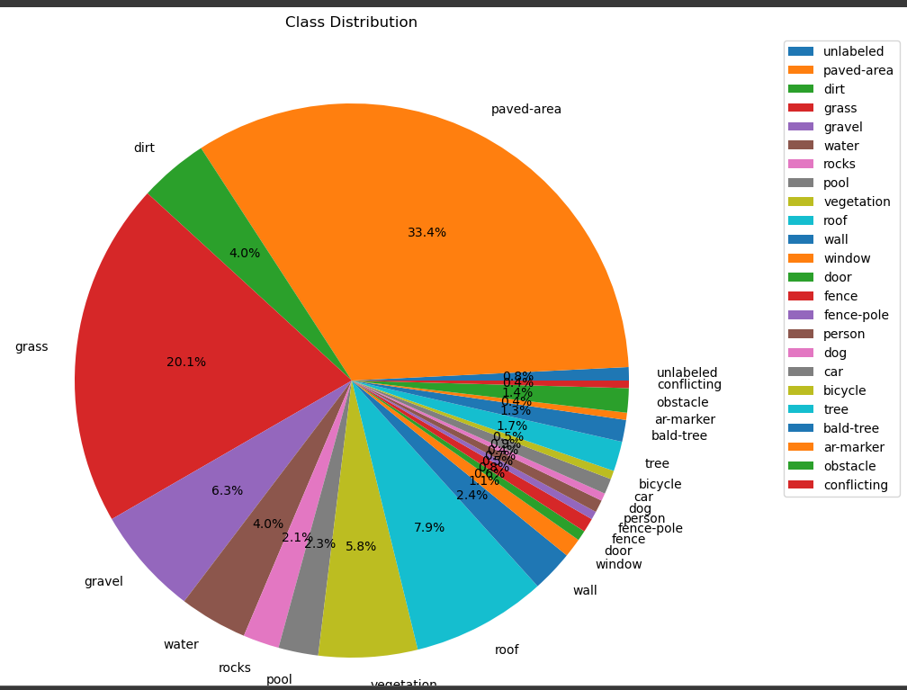
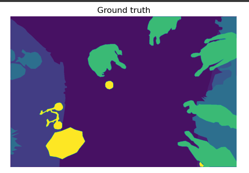
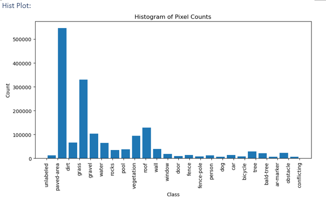
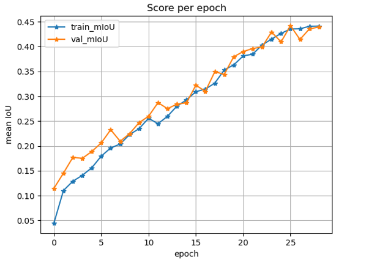
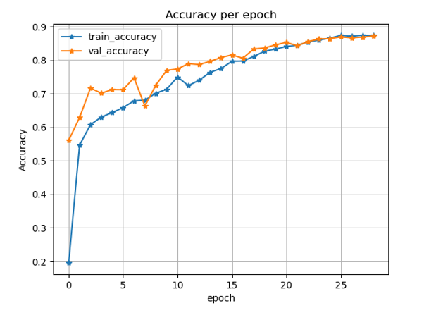
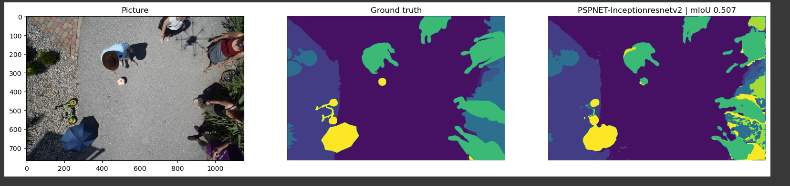

# Drone Image Semantic Segmentation

A lightweight yet powerful workflow for **semantic segmentation of aerial imagery**.  
Using a UNet decoder paired with a MobileNetV2 encoder, the model learns to delineate objects such as terrain types, buildings, vehicles, and vegetation in high-resolution drone photographs.

---

## 1. Overview

Modern construction, mining, and environmental projects rely on fast, precise understanding of drone data.  
This repository delivers:

* **Automated object masks** with near-real-time inference  
* A **compact `.pt` weight** (< 10 MB) ready for edge or cloud deployment  
* An interactive **Dash app** for exploration and validation  

---

## 2. Dataset

The work is built on the **Semantic Drone Dataset**, which pairs each RGB scene with pixel-level annotations of 23 everyday classes—ranging from paved roads and grassy areas to vehicles and trees.

| Sample label mask | Histogram of class frequencies |
|-------------------|--------------------------------|
|  |  |

### 2.1 Class Distribution

| Class | Pixels |   | Class | Pixels |
|-------|--------|---|-------|--------|
| unlabeled | 12 714 | | window | 18 210 |
| paved-area | 546 694 | | door | 9 813 |
| dirt | 66 101 | | fence | 13 458 |
| grass | 329 861 | | fence-pole | 7 821 |
| gravel | 103 629 | | person | 11 901 |
| water | 64 980 | | dog | 7 253 |
| rocks | 34 511 | | car | 14 804 |
| pool | 38 056 | | bicycle | 8 148 |
| vegetation | 94 435 | | tree | 28 498 |
| roof | 128 798 | | bald-tree | 20 871 |
| wall | 39 916 | | ar-marker | 6 878 |
| obstacle | 23 218 | | conflicting | 7 160 |

> **Why it matters** A balanced understanding of class frequency prevents bias toward dominant surfaces (e.g., paved-area), ensuring minority objects like pedestrians or markers are still detected accurately.

---

## 3. Architecture

The network follows the classic **UNet** encoder–decoder paradigm with five up-sampling stages:

* **Encoder:** *MobileNetV2* pretrained on ImageNet—striking a balance between accuracy and speed  
* **Decoder blocks:** channel widths `[256 → 128 → 64 → 32 → 16]` with skip connections to preserve spatial detail  
* **Output:** multi-channel mask with softmax probabilities per class

This choice delivers state-of-the-art mIoU while fitting comfortably on embedded GPUs or mid-range CPUs.

---

## 4. Training & Evaluation

Model optimisation minimises a compound loss (Cross-Entropy + Dice).  
Progress is tracked via:

* **Training / Validation Loss**  
* **mIoU (mean Intersection over Union)**  
* **Pixel Accuracy**

Early stopping and learning-rate warm restarts keep convergence stable.

---

## 5. Results

| Predicted mask (overlay) | Segmentation comparison |
|--------------------------|-------------------------|
|  |  |

A final qualitative assessment on unseen sites confirms robust generalisation to new terrains and lighting.

---

## 6. Interactive Dashboard

Spin up **Dashboard.py** to:

1. Browse raw images, masks, and predictions side-by-side  
2. Toggle class visibility for focused inspection  
3. Export masks as transparent PNGs for later GIS or CAD workflows  

---

## 7. Quick Start

1. **Clone** the repository  
2. **Install dependencies** listed in *requirements.txt*  
3. Run the **dashboard** or integrate `Unet-Mobilenet.pt` into any Python inference pipeline

---

## 8. Roadmap

* **Real-time streaming** for live drone feeds  
* **Self-supervised pre-training** on unlabelled aerial footage  
* **On-device quantisation** for microcontroller deployment

---

## 9. License & Citation

This project is released under the MIT License.  
If you find it useful, please cite the repository and feel free to open issues or pull requests—collaboration is welcomed!

---

*Crafted with a focus on clarity, efficiency, and field applicability.*  
